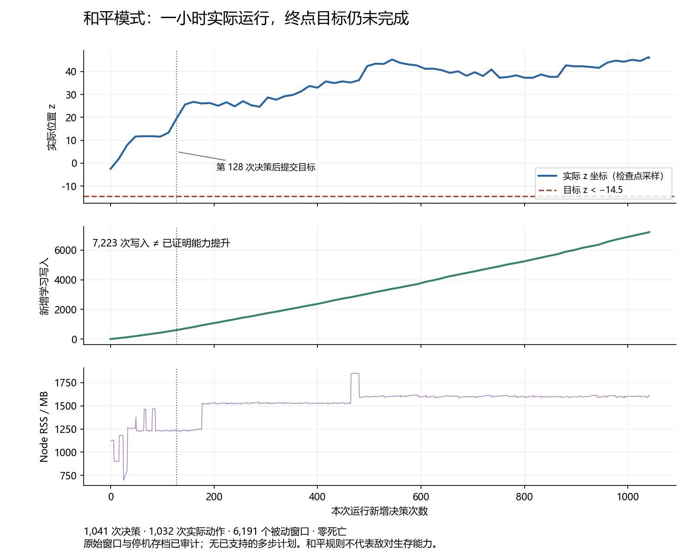

# Native continuation, 2026-09-13

Source: GitHub main `9334c27c4b147fa2d8457686ed94cf70fa6198cc`, containing the recovered original `ea097eb` snapshot. All 382 original source files were verified against their saved hashes. The missing historical 121-test scheduling patch has not been recovered. The repair here is new.

## Controller and apparatus

`implemented`: while a measured maintenance need and a pending external task coexist, the session alternates completed service opportunities. Refused actions and unavailable offers consume opportunities too. This prevents an unresolved body need from excluding external tasks indefinitely. The initial category remains maintenance. Task FIFO and the existing ordering of body needs remain unchanged. Same-world snapshots preserve the category; transfer clears prior task ownership. The state contains no action effects, motor identities or solutions.

`validated`: a deterministic regression failed against the original controller. Four added tests cover service fairness, both permutations of learned physical effects, frozen model/affordance digests, six distinct later actual confirmations, FIFO, repeated-frame rejection, same-world equivalence, transfer and legacy checkpoints. The focused gate passed 5/5 and the integrated gate passed 124/124. The first full attempt was 123/124: the existing ten-causal-stage test returned `unknown`. It recurred in the renderer gate (124/125). That synthetic composition test now uses a deterministic 512-expansion budget and no wall deadline; a zero-wall-budget check separately requires `unknown`, zero actions and unchanged learned state. All ten stages, ablation, later actual confirmations and restart assertions remain. `runGoal` forwards the already supported planning time option. Native defaults stay 100 ms supported / 50 ms exploratory. That integrated gate passed 125/125; all failed logs remain. Later extensions below bring the current total to 127/127.

Windows apparatus fixes use POSIX tar member names, handle CRLF tar listings, read the archive report as UTF-8, and import absolute build paths through file URLs. The recorded planning profiler additionally accepts an exact goal ID instead of silently selecting the historical coordinate goal. It rejects missing or conflicting identities and records the selected definition, source model hash and script hash. Its profiling operation performs no learning or physical actions.

## R1: actual V51 same-world continuation

The V51 release ZIP matched SHA256 `b91a9dff21de09e5fc0fd9c1d168dad8d29d9535c2d7a77ad0a5c2f61b6361ce`. Its session matched `80c5707a74816434968924c80b11324d6ee567d763cb50eed9fb4400059b0d17`. Restoring the session preserved 1600 decisions, 1445 executed actions and 3149 writes. The run began in a separately prepared copy of the stopped world at exactly the saved position, with an empty hotbar.

The actor used an immutable copy of 587 compiled and harness files. Its freeze manifest SHA256 is `a6ec5fcb217a11498b14edd4a4caf88d12207556e137dcbafacbf8d78e91dfb6`. No reset, teleport, setup command or externally selected action was introduced. A newly named terminal goal required `position.z < -16.10145494124189` and `gripCount > 0`; it supplied no action or subgoal sequence.

| Measure | R1 observed result |
| --- | ---: |
| New decisions | 128 |
| Completed physical action windows | 124 |
| Separate passive windows | 307 |
| New learning writes | 431 |
| External task / maintenance decisions | 92 / 36 |
| Reported elapsed seconds, including overhead | 277.572 |
| Server-confirmed deaths | 16 |
| Supported task plans / multistep task plans | 0 / 0 |
| New terminal goal | pending |
| Sampled Node RSS range, MB | 730.289–1334.797 |

`validated`: every audited active/passive window matches its saved hash and endpoints. The saved final player position agrees with the final observation. The stopped-world archive SHA256 is `0a799bd4bc5c39a67de546f4dbfd0774756fee98010af4a83f1e36ad29a684e0`.

`rejected` for this trial: survival and causal multistage success. All recorded frames had `gripCount = 0`. Crossing the coordinate threshold alone did not complete the conjunction. Sixteen deaths and controller-selected respawns are not survival. Hypothetical plans are not accepted predictions or verified causal execution.

## Recorded prediction diagnostic

The original V51 model was evaluated on the 124 new action windows before observing their outcomes. A frozen replay was compared with sequential predict-then-learn replay. The latter includes the 11 explicitly selected passive actions among those 124 executed windows, but omits the 307 separately recorded passive-event updates; it is not an exact reconstruction of the live learning stream.

| Measure | Retained frozen | Retained sequential replay |
| --- | ---: | ---: |
| Windows with all three supported position coordinates | 23 | 22 |
| Windows with all three supported coordinates correct | 8 | 8 |
| Windows with all three hypothetical coordinates correct | 13 | 21 |

These are offline diagnostics with zero new physical actions. The increased hypothetical accuracy is limited evidence of adaptation to this stream, not proof of learning benefit on a new task, reliable supported prediction, or long-term competence. Neither comparison replaces matched erased-memory native controls.

## Ongoing work and evidence location

R2 is stopped and independently audited. It completed 387 new decisions, 371 physical action windows, 1147 separate passive windows and 1518 writes in 812.314 seconds, with 44 server-confirmed deaths. It had two supported single-step task plans, no supported multistep plans, and no new task success. It was gracefully paused after identifying a sensor omission. Its stopped-world archive SHA256 is `a766b9fb1bcfce597bbca53fcf3927d5ab219f02a6b0d86520816a171d4c26fa`.

`validated` apparatus repair: the installed viewer catalog omitted a default texture for zombie villagers and villagers despite containing their base images. The renderer now falls back only to an existing, decoded exact base image. Existing 73 colors remain unchanged; 15 additional entity images are supported. In the isolated native red/green calibration, the old actor saw zero zombie-villager pixels and offered no attack. The corrected actor saw 65 pixels, offered the anonymous physical attack, and correctly lost both pixels and attack availability behind a wall. One apparatus-selected attack reduced independently queried server health from 20 to 19.06. This is a sensor/actuator calibration with zero autonomous learning trials, not learned combat skill; its windows were not added to the model.

The user requested peaceful mode before increasing scenario complexity. The new evaluator explicitly selects and records difficulty, queries the engine before the learner connects, and the stopped-run audit checks saved `level.dat`. `peaceful-natural-initial` initialized natural seed `129604783` at `[-3.5,74,-2.5]`, with empty hotbar, zero controller actions and unchanged 5098 learning writes. The engine reply and saved difficulty byte 0 both confirm peaceful survival mode. Its stopped archive SHA256 is `9d841f5841b36b020fa62c76e9bf5e73a8525b42e458e05600f6910bdff30a22`.

Four initial copies have identical world-tree hash `e9eab215b68c7e0dbdb2399217ef799cceb37a5e84f0da4a323910298044416b`. Erasing one copy removed only learned dynamics and affordances (5098 to zero writes), preserving world files and sampling counter 1801. The actual Windows erasure operation completed. The actor freeze manifest is `b21ebc8753c2886d37bf1f4d605a1d360ccd0cb41638e37847974e99d3bdbb8c` (`execution-builds/peaceful-r3`, 585 files).

Matched retained-frozen and erased-frozen trials used terminal `z < -14.5` and budgets of 192 decisions / 480 seconds. They ran sequentially from identical world files, initial empty inventory and sampling counter. Both initial goals were unsatisfied; both final world/window audits pass and their learned digests remain unchanged.

| Peaceful native measure | Retained frozen | Erased frozen |
| --- | ---: | ---: |
| New decisions / actual action windows | 46 / 40 | 192 / 191 |
| Goal | verified | pending at budget |
| New learning writes / deaths | 0 / 0 | 0 / 0 |
| Elapsed seconds including startup and checkpoint | 108.082 | 184.910 |
| Supported task plans / multistep plans | 25 / 0 | 0 / 0 |
| Final z | -14.9151 | 18.7 |

`evidence-backed` within this one pair: retained experience improved the outcome of a new-world locomotion task. The retained run confirmed success on six distinct measured frames (1499–1504), with independent server position and stopped-player agreement. This is not a repeated-seed effect estimate or causal multistage success. Only 2/25 supported goal-axis forecasts matched their declared numerical bounds; no whole forecast matched all channels. Directionally useful behavior did not establish reliable calibration.

The impossible `health < -1` control remained pending after 64 actual actions in 141.419 seconds, with no false confirmations, deaths or learning writes. Its stopped-world audit passed. Compact, reproducible results and timeline data are in [native-evidence-2026-09-13](native-evidence-2026-09-13/peaceful-matched-comparison.json).

`evidence-backed` partial causal execution: `peaceful-causal-online` started with empty experience in a static peaceful two-layer enclosure and received only an exit goal (`z < -4.2`). Its first 512 decisions/actions generated 2070 actual learning writes in 1120.999 seconds. The saved world independently confirms five removed plank cells and five items in inventory. The exit remained blocked and there were no supported task plans. A same-world R4 continuation added 433 actions and 2196 writes in 1218.779 seconds. Its saved world contains seven removed barrier cells and four planks in inventory; the goal remains pending. All 945 physical windows across both segments pass the independent audit, and both segments have zero deaths. This establishes exploratory partial prerequisite execution, not supported causal multistage planning or terminal success. Hypothesis lengths are reported separately from supported plans.

The enclosure inspector now reads the exact verified stopped archive rather than mutable runtime files. Repeating the first-segment audit after the second segment advanced the world still reports its original five removed cells, original player and original position. The two historical outcomes remain distinct.

`validated` evidence metadata: R4 copies the active goal definition and baseline sequence into each decision, including autonomous intentions that disappear from live state after completion. The regression verifies six actual distinct observations and prevents a consumer of the record from mutating the active goal. The integrated gate passed 126/126; the first real continuation decision also contains the exact goal and baseline sequence. This improves inspectability and is not a new autonomy result.

`implemented` progress repair: R5 credits an actual action-window decrease in goal residual even when it has not regained a historical best. The earlier rule repeatedly rejected real recovery moves, eventually triggering a 17-decision cooldown. A preserved interim native witness contains 156 such uncredited advances, 14 followed by cooldown within nine decisions; it binds the exact goal, baseline and original hashed windows. The regression fails under the previous rule and passes under the repair, including unchanged state, numerical drift, irrelevant motion and frozen learned digests. The historical best remains monotonic. The active integrated gate is now 127/127; native 100/50 ms planning deadlines remain unchanged. Real controller benefit is still an experimental question.

`evidence-backed` one-hour native run: `peaceful-natural-online-long` stopped normally at 19:35:30.555 UTC on 2026-09-12 after 3615.815 seconds, including startup/checkpoint overhead. Its immutable R3 actor completed 1041 new decisions, 1032 actions, 6191 passive windows and 7223 actual learning writes, with zero deaths. The goal remained pending; all 47 supported task plans were one step. The saved player matches the final observation at `[8.3,61.875,46.01216825431156]`. Node RSS samples ranged from 698.74 to 1853.42 MB, and the final compressed model was 31,140,359 bytes. These data establish a sustained native learning opportunity and preserved state, not beneficial long-term adaptation or lifelong competence. The complete trace identifies 262 uncredited actual task advances, 36 followed by cooldown within nine decisions.

The bounded R5 causal continuation also stopped after 128 additional actions and 638 writes in 412.827 seconds. Its original windows independently confirm all nine actual goal advances, with no uncredited advances or false credits. The seven removed barrier cells are unchanged, and the exit remains pending; final residual increased from 0.271739 to 0.294365. The three same-world causal segments total 1073 actions and 4904 writes. This validates progress bookkeeping, not improved task completion.

The registered [progress-recovery protocol](native-evidence-2026-09-13/peaceful-progress-recovery-protocol.md) compares frozen R3/R5 copies of the exact one-hour final state, sequentially. Its first launch omitted the explicit custom goal, allowing the historical harness to add a default second task. That 45-action, zero-write attempt was gracefully stopped, archived and excluded from the matched pair. A fresh control copy comes from the unchanged original archive; both valid launches explicitly select the original goal. The root evaluator now rejects that ambiguous custom-task continuation before starting the engine. A CLI boundary check covers rejection and acceptance of the explicit existing goal with Java unavailable, adding zero native trials. The valid comparison has now stopped and passed both independent window/world and frozen-digest audits. Both actors started at exactly `[8.3,61.875,46.01216825431156]` with the same learned digest and one pending task. R3 performed 93 actual actions in 96 decisions, while R5 performed 95. Both ended farther from the target and neither completed it. R3 left all 16 actual task advances uncredited; R5 credited all 18, with zero false credits. Neither entered a cooldown in this short pair, so this comparison does not establish improved task performance from the repair. Ordinary native timing and shared-host variability also prevent treating it as an exact replay or precise effect estimate.

A separate registered retention test uses the original initial world, original choice counter 1801, unchanged R3 actor and original 192-decision / 480-second budget. Only transferable dynamics and affordances are replaced by the one-hour model. The preparation asserts every nonlearning state field and every world file unchanged, preserves both source hashes and rejects a second transplant. It adds zero physical trials. The real frozen test has now stopped and passed the original-window, saved-world and unchanged-digest audits. Before online learning, R3 completed the goal in 40 actions / 46 decisions, with 25 supported task plans. After the one-hour updates, the same R3 actor executed 191 actions / 192 decisions in 351.602 seconds and did not complete it; it produced zero supported task plans and 63 hypotheses. Both tests had zero writes and zero deaths, identical initial world bytes, matching goal/actor/harness and the same 192-decision / 480-second budget. The post-learning player ended at `[9.732385107196716,60.875,3.638440234311854]`. This is a concrete regression in task performance in this matched initial scene; it is not a general estimate of catastrophic forgetting.

The later model was also examined on the exact preserved action-start frame 19 from the earlier successful trial, with the same baseline and initial choice counter. The earlier model found a supported single-step approach at 100/500/2000 ms; the later model found none at all three budgets. Its longer hypothetical plan includes a later respawn, which is neither an accepted forecast nor an executed solution. This zero-trial, zero-write diagnostic shows that simply increasing the tested planning time budget did not recover a supported approach on this frame. Calibration-driven withdrawal of unreliable predictions, representation/retention and native task performance must be investigated separately; the earlier model's numerical accuracy was already poor.

A causal multistage claim requires independently checked prerequisite changes and supported predicted-step traces; a conjunction, repeated movement or curiosity-only success is insufficient. Peaceful rules exclude claims of hostile survival and hunger management. Persistent task failure in this simplified scene requires checking prediction quality, the controller and actuator fidelity; hostile difficulty cannot explain it alone. The earlier synthetic ten-stage failure concerned wall-clock test design; it was not native evidence.

Portable evidence preparation accepts an explicit checkpoint registry. It verifies the exact report, model, archive, provenance and each world member before creating a relocated predecessor. A modified registry is rejected before creating a destination. The package builder includes only registered stopped worlds and explicit supporting files, verifies every ZIP member, rejects changed inputs and excludes mutable runtime directories. Its three apparatus tests pass; synthetic packaging fixtures are never counted as native trials.

Local evidence is under `D:/Kairos project/.kairos/worktrees/native-continuation-20260913/evidence`. Command manifests, failed and successful test logs, immutable execution copies, original journals/windows, sessions and world archives are retained there. `native-v51-r1-audit.json` is the independent stopped-run audit. Source and compact reports are kept in Git; large raw evidence will be packaged separately with hashes after the experiments finish.

The body still uses engineered 25×19 RGBD, approximate entity/fluid optics, owned physiology and visible hotbar signals. It does not establish full client vision, general inventory UI interaction, language grounding, reliable long-term survival or unrestricted open-world competence.

## Evidence boundary and next engineering target

The current evidence supports an initial experience-transfer benefit and a sustained one-hour native learning opportunity, plus actual exploratory partial prerequisites. It does not support successful long-term adaptation, retained task performance after the new updates, autonomous intention completion in these native runs, or supported open causal multistage completion. The controller repair is validated as progress bookkeeping, with no measured task-completion benefit in its small frozen pair. All limitations and failures are preserved.

Keep peaceful mode and the existing simple scene. The next engineering target is the loss of usable, calibrated task predictions after continued learning, using the exact before/after models and frame-19 comparison in this package. The actuator defect below is now repaired, but its effect on learning and retention remains unmeasured. New physical learning should use the corrected actor and preserve actual release receipts; historical model data must not be relabelled as if their controls had already been repaired. Continue inspecting contextual retention and prediction support. Do not obtain success by weakening support criteria, teaching a prescribed route, treating hypothetical respawn as execution, or feeding goals/imagined outcomes into learning. A repaired model should first retain the earlier simple task under the same frozen comparison, then demonstrate supported prerequisite changes in the physical barrier task.

## Actuator timing diagnosis and native repair

`evidence-backed` offline diagnosis: the later backward-motor circuit retains
86 of 173 earlier samples after 174 new writes. Three of six samples in the
old frame-19 longitudinal-motion region survive. The later partition selects
a different ten-sample region, with outcome standard deviation about 0.540
and zero correct contextual forecasts there. The old model itself relied on
the global regression fallback: the local region had only six calibration
samples and was unsupported. This does not establish that all task regression
is forgetting; inaccurate early support and later withdrawal also matter.
The inspection uses frozen snapshots and adds zero physical trials or writes.

`validated` actuator defect: the installed Mineflayer physics loop can deliver
four synchronous catch-up ticks. Releasing a held control only after awaiting
a promise lets the next steps in that batch read the still-pressed control.
A boundary regression reproduces three extra pressed ticks for movement,
held jump and held-item use. The body now releases these offered controls in
the frame callback at their deadline, and releases on interruption. It records
the requested duration and actual release sequence. Legacy jump pulse syntax
retains its historical behavior and is outside this offered-action repair.

The registered peaceful native calibration uses three alternating unloaded /
230 ms loaded pairs on a flat platform for each actor. Its independent SDK
listener observes controls before the body's callback. Original R5 press counts
are `[4,4,4,4,4,7]`; corrected R6 counts are `[4,4,4,4,4,4]`. The overlong original
press travels 1.5073127400 blocks; the other eleven presses travel 0.8571697198.
All twelve endpoints agree with the independently queried server positions.
The original windows, control samples, release records and server replies pass
`audit-native-motor-catchup.mjs`. The candidate freeze manifest SHA256 is
`b7f6119c8302198d486c5dc85290072dd2400a3dd5b59ea790a7970d0513885d`.
All native calibration processes are stopped.

The corrected source passes 131/131 integrated checks; the separate focused
body/passive group passes 28/28. The failing pre-repair log is preserved.
These twelve evaluator-selected actions are apparatus calibration, with zero
autonomous trials and zero learning writes. Native jump/item calibration was
not performed. Historical native runs did not record exact control release,
so this pair cannot determine how often overshoot occurred in them or how much
of their retention failure it explains. Improved long-term learning remains
a hypothesis requiring fresh physical learning and matched retention tests.

## R6 frozen candidate check

The valid R6 follow-up is stopped and independently audited. Its prepared
input is byte-identical to the earlier R3 post-learning test
(`6e71f4f4f4059f4ca22a76b7d9b84955f3d86b6f892db99877e86999b243e574`),
with all 23 initial world files checked before launch. It uses the same goal,
192-decision / 480-second budget and initial nonlearning state. R6 completes
192 decisions and 191 actions in 396.926 seconds, with zero deaths and zero
learning writes; all 498 passive windows and active windows are retained.
The goal remains pending, with zero supported task plans and 61 hypotheses.
The final saved player agrees with `[5.7,63,-9.7]`, and the frozen learned digest
is unchanged. The archive SHA256 is
`3f18f1ff9a978ee3c1206855ac473f8d0ba0d438fe9e073fba03454abf4d58b2`.

This composite candidate includes the R5 recovery change as well as the R6
actuator fix. Its endpoint is closer than the R3 reference, but both fail;
one such comparison cannot establish a reliable task benefit or attribute
an effect to one change. It provides no new learning episode. The older R6
harness filtered release diagnostics, so exact per-action release receipts
are available in the separate calibration, not this task run. Current source
now journals them and optionally pins exact input bytes with
`--expected-session-sha256`; its CLI rejection/acceptance test passes.

One premature launch loaded the earlier 5098-write model before preparation
finished and executed ten actions. It was paused, archived and audited, and
is explicitly excluded from the comparison. The valid replacement used a new
world fork and completed model/world verification. Both originals are kept in
the separate R6 retention registry. The enclosure-only inspector also rejected
the natural-world checkpoint as out of scope; the applicable continuing-run
auditor confirms the peaceful saved world, player, windows and model digest.
These failed operations are retained and do not become successful evidence.
